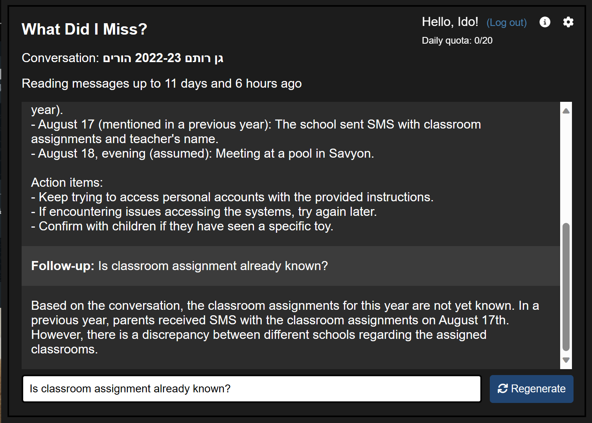
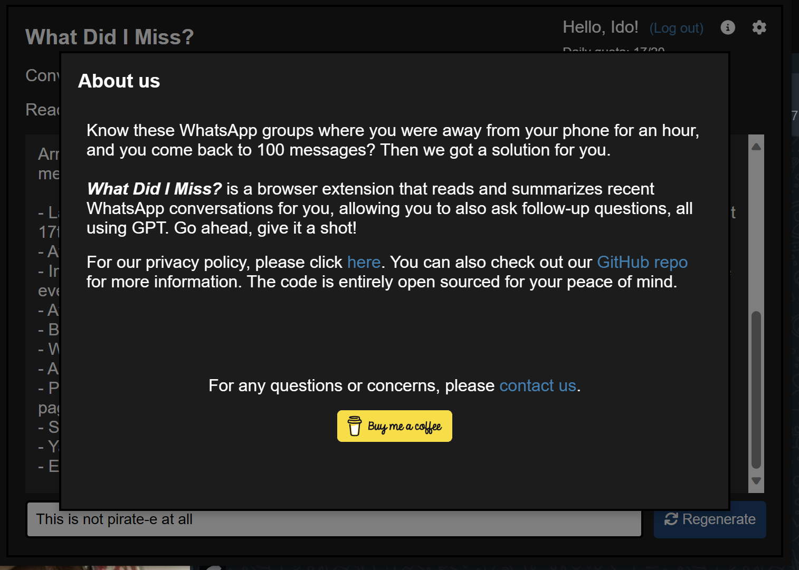
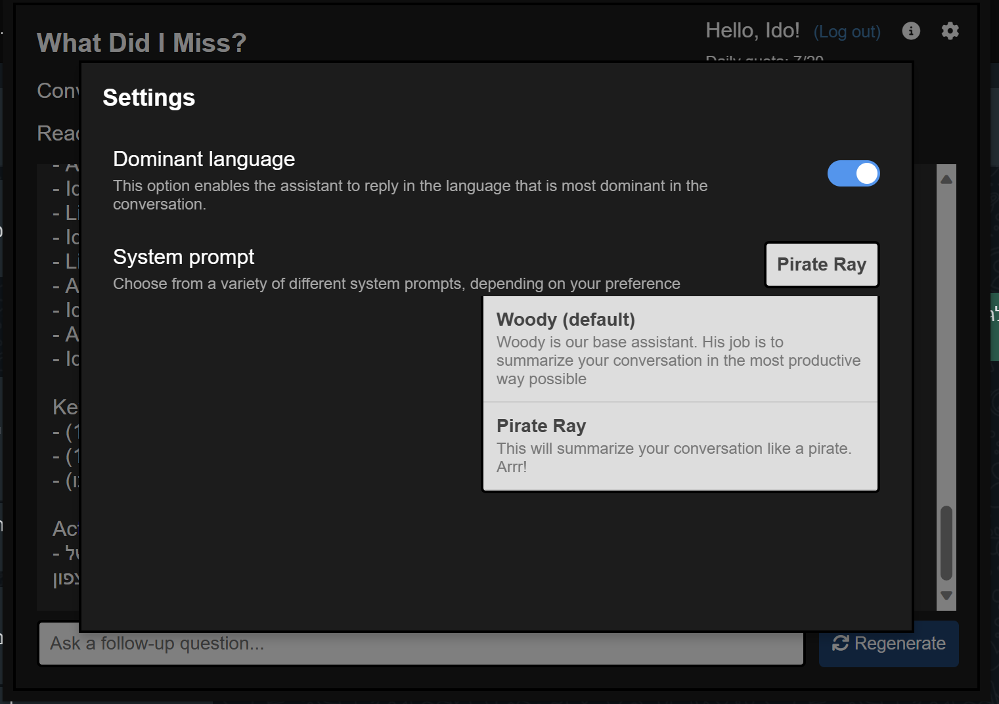

# Project Summary

This project aims to improve the user experience of the website by adding new features and fixing existing issues.

# Usage

To use this project as a browser extension, follow these steps:

1. Clone the repository to your local machine.
2. Open your browser and navigate to the extensions page.
3. Enable developer mode.
4. Click on "Load unpacked" and select the cloned repository folder.
5. The extension should now be installed and ready to use.

## Screenshots

